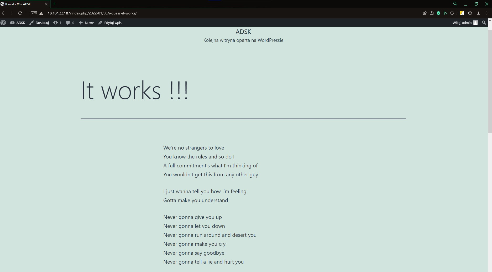

# **Instalacja Wordpress**
## ***0. Stworzenie maszyny Amazona i ustalenie z nią połączenia***
## ***1. Instalacja narzędzia Ansible***
    yum install ansible
## ***2. Tworzenie plików z konfiguracjami i poleceniami instalującymi***
* ### hosts.ini *(plik zawierający nazwę i IP hosta z którym się łączymy oraz nazwę użytkownika)*
        [wp_nodes]
        18.184.32.187 ansible_user=ec2-user
* ### setup_wordpress.yaml *(plik zawierający zadania i zmienne bazy dancyh [w tym przypadku rozdzielone na kilka innych plików] dla ansible)*
* ### files
    * ### blog-vhost.config *(plik w którym ustalamy na jakim porcie będzie nasza aplikacja i nazwę pliku strony startowej)*
            <VirtualHost *:80>
            DocumentRoot "/var/www/wordpress"
            DirectoryIndex index.php
            </VirtualHost>
    * ### Mariadb.repo *(plik wskazujący repozytorium w którym znajduje się baza danych)*
            https://mariadb.org/download/?t=repo-config
    * ### wp-config.php *(plik zawierający podstawowe informacje konfiguracyjne strony takie jak nazwa bazy danych czy użytkownika itd.)*
            define( 'DB_NAME', '{{DB_NAME}}' );
            define( 'DB_USER', '{{DB_USER}}' );
            define( 'DB_PASSWORD', '{{DB_PW}}' );
            define( 'DB_HOST', 'localhost' );
            define( 'DB_CHARSET', 'utf8mb4' );
            define( 'DB_COLLATE', '' );
* ### tasks *(tu znajdują się rozdzielone zadania dla Ansible)*
    * ### db.yaml *(plik zawierający polecenia instalacyjne i konfiguracyjne dotyczące bazy dancyh)*
    * ### os.yaml *(plik zawierający polecenia instalacyjne serwera http itp.)*
    * ### wp.yaml *(plik zawierający polecenia instalacyjne i konfiguracyjne dotyczące Wordpressa)*
* ### vars
    * ### main.yaml *(plik zawierający zmienne uwierzytelniania bazy danych)*
## ***3. Instalacja wszystkich programów i kofiguracji***
### Jeśli wszystko zostało poprawnie uzupełnione i zapisane to po wykonaniu komendy:
     ansible-playbook -i hosts.ini setup_wordpress.yaml
### wszystko powinno zostać zainstalowane na wybraną przez nas maszynę i po wpisaniu jej IP w dowolną przeglądarkę powinien wyświetlić się nam nasz blog.

